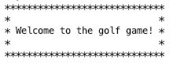
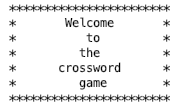
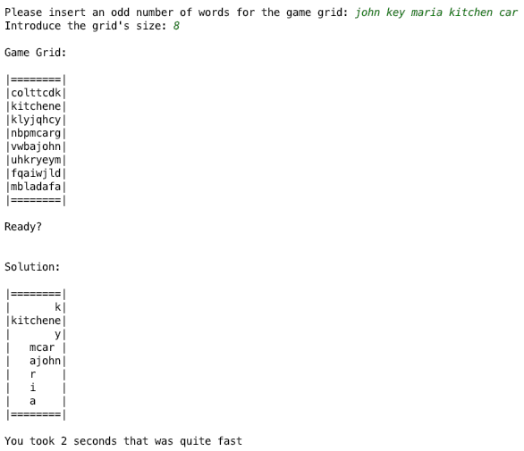
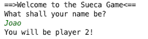
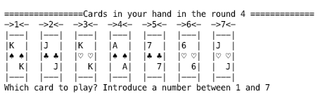
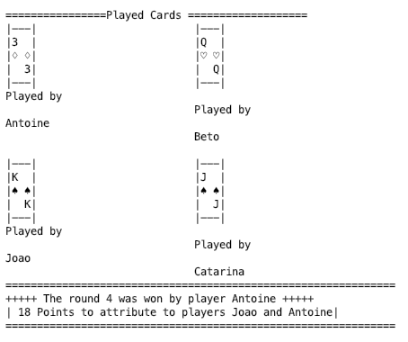
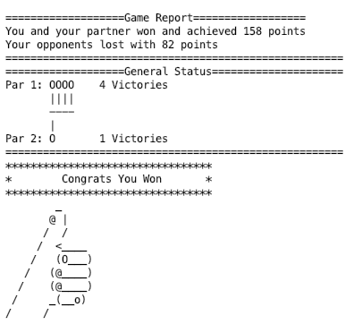
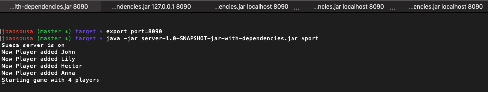
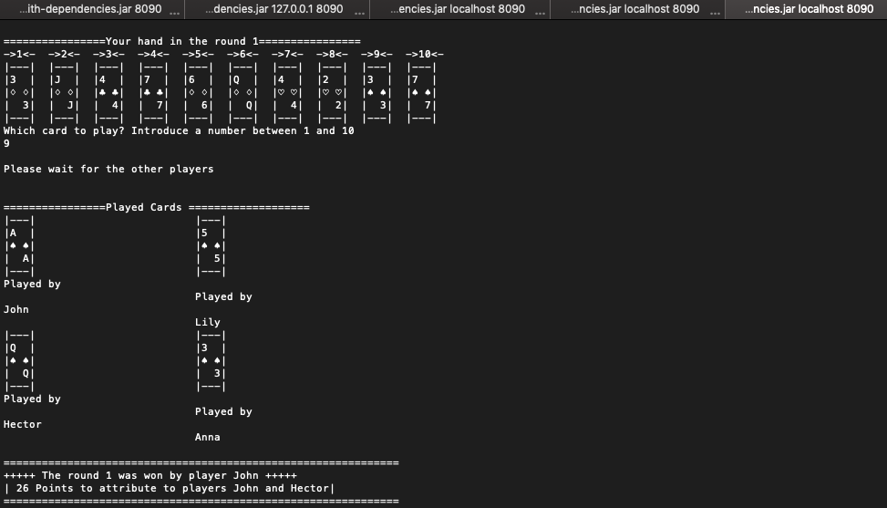

# Java beginners games
A set of interactive games to exercise core java features

- Golf game 
  

  

- Crosswords 
  

- Card Game SinglePlayer 
  

  

- Card Game Multiplayer 
  

  

  
